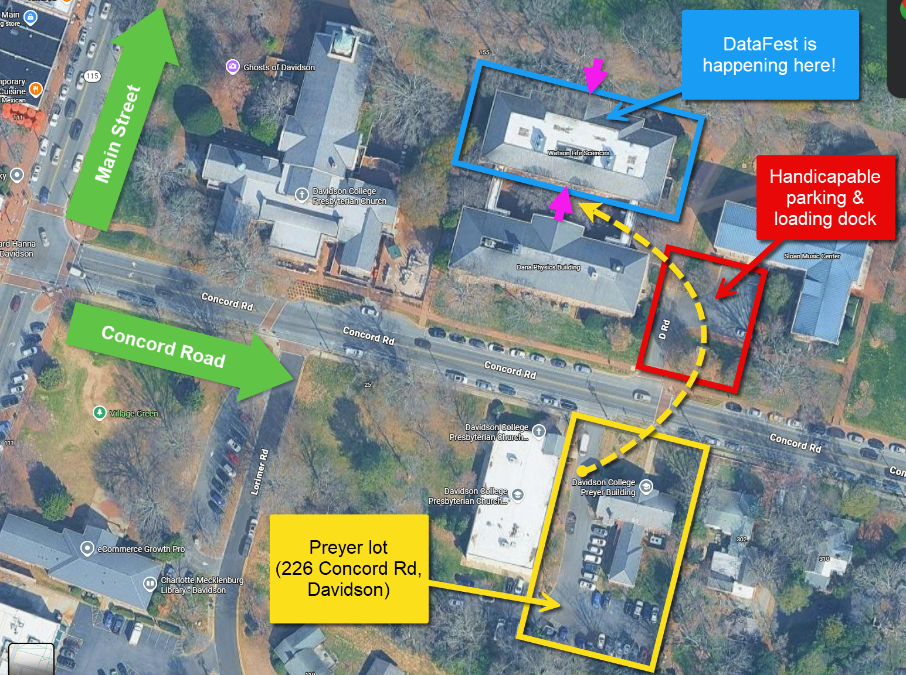
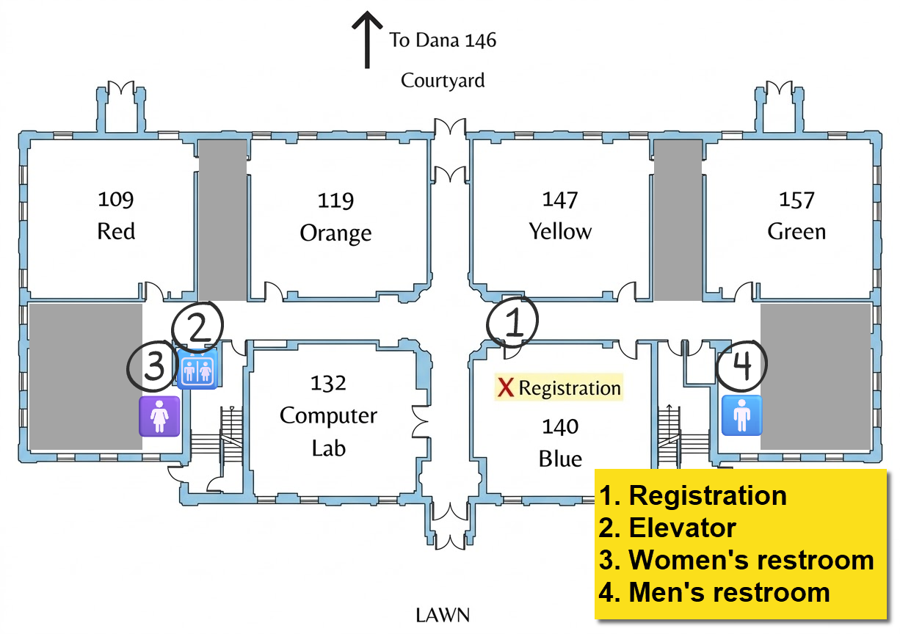

:::{#hero-heading}
```{=html}
<div id="flipdown" class="flipdown" style="display:none;"></div>

<script>
  const eventDay = '';
  const eventTime = '10:00:00';
  // Look up the Eastern offset on the event day so DST is handled automatically
  const tzName = new Intl.DateTimeFormat('en-US', {
    timeZone: 'America/New_York',
    timeZoneName: 'longOffset'
  }).formatToParts(new Date(`${eventDay}T12:00:00Z`))
    .find(p => p.type === 'timeZoneName').value;
  const targetDate = new Date(`${eventDay}T${eventTime}${tzName.slice(3)}`);
  const daysUntil = (targetDate - new Date()) / (1000 * 60 * 60 * 24);
  if (daysUntil > 0 && daysUntil < 100) {
    document.getElementById('flipdown').style.display = '';
    new FlipDown(targetDate.getTime() / 1000).start();
  }
</script>
```
:::


## What is the Public Good Data Wrangle? {#about}

Brought to you by the [Martin Institute for Public Good](https://www.apublicgood.com){target="_blank"} and the Davidson College Department of Data Science, the Public Good Data Wrangle (PGDW) is an annual one-day "data science hackathon" that brings together a group of interdisciplinary student programmers and data enthusiasts to tackle a challenge that relates to issues of public significance.

In 2025, we analyzed millions of rows of high school and college admission data to look for potential inequities in the college recruitment process.

In 2026... the sky is the limit!

---

## Location {#location}

Data Wrangle 2026 will be taking place in the Watson Life Sciences building on Davidson's campus. Limited parking is available in the Preyer lot, which is directly across the street at 226 Concord Rd, Davidson, NC 28036. Additional public parking is available along Concord Road.

<iframe src="https://www.google.com/maps/embed?pb=!1m18!1m12!1m3!1d1433.7712338430547!2d-80.84767879290608!3d35.49958731445351!2m3!1f0!2f0!3f0!3m2!1i1024!2i768!4f13.1!3m3!1m2!1s0x8856aa3657441de1%3A0x75a76ac021be6677!2sWatson%20Life%20Sciences%2C%20225%20Concord%20Rd%2C%20Davidson%2C%20NC%2028036!5e1!3m2!1sen!2sus!4v1770923375616!5m2!1sen!2sus" width="100%" height="450" style="border:0;" allowfullscreen="" loading="lazy" referrerpolicy="no-referrer-when-downgrade"></iframe>

{.lightbox}

{.lightbox} -->

---

## Schedule {#schedule}

### Friday, October 2

| Time | | Location | Event |
|----|--|----|--------------|
| 4:30–6:00 PM | ✅ | Watson 140 (Blue) | **Launch party and data reveal!** Early check-in at the welcome desk: get your nametag, t-shirt, swag, and materials! Take a sneak peek at our dataset and get a bite to eat. Come and go as you please! |

### Saturday, October 3

*Arrive in Watson 140 by 9:00 AM on Saturday to be entered in a prize drawing!*

| Time | | Location | Event |
|----|--|----|--------------|
| 9:00–10:00 AM | 🥐 | Watson 140 (Blue) | Check in at the welcome desk if you haven't already, and pick up a delicious breakfast and coffee |
| 10:00–10:30 AM | 🧑‍🏫 | Dana 146 | **Official kickoff**, presented by The Allison S. and Thomas C. Franco Program on Public Policy and Research |
| 10:30 AM–Noon | 🧑‍💻 | Group workspaces | Work session |
| Noon–1:00 PM | 🍕 | Watson 140 (Blue) | Lunch served |
| 1:00–5:30 PM | 🧑‍💻 | Group workspaces | Work session with your team |
| 5:30 PM | 🧑‍💻 | Group workspaces | **Presentation slides due** |
| 5:30 PM | 🍛 | Watson 140 (Blue) | Dinner served from Thai House |
| 6:00–7:00 PM | 🏆 | Dana 146 | **Presentations and Awards Ceremony** |

---

## Frequently Asked Questions (FAQ) {#faq}



---

## Organizers {#organizers}

:::: {.columns}

::: {.column width=45%}


### The Martin Institute for Public Good

- Dr. Chris Marsicano '10
- Dr. Ken Menkhaus
- Dr. Kevin McElrath
- Dr. Stacey Riemer

:::

::: {.column width=10%}

:::

::: {.column width=45%}


### Department of Data Science

- Dr. Laurie Heyer
- Dr. Kevin Wang
- Prof. Pete Benbow '07

:::

::::
